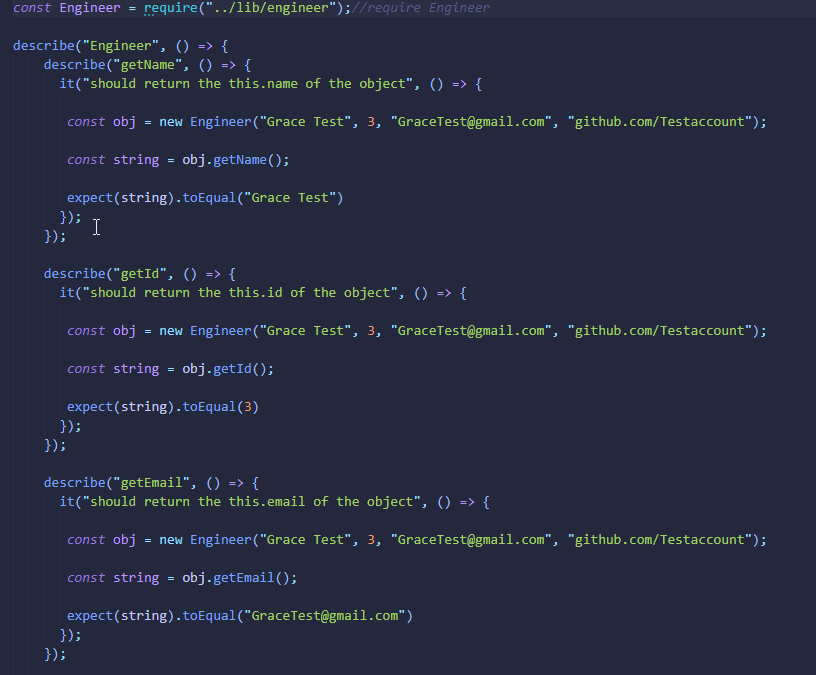
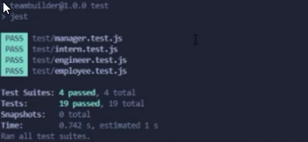

# Michael Ariti - Team Builder

[](https://opensource.org/licenses/MIT)

|  Table of Contents |
| ----------- |
| [1. Description.](#description)|
| [2. User Story.](#user-story) |
| [3. Acceptance Criteria.](#acceptance-criteria) |
| [4. Installation.](#installation) |
| [5. Usage.](#usage)|
| [6. License.](#licenses)|
| [7. Contributing.](#contributing)|
| [8. Tests.](#tests)|
| [9. Technologies Used.](#technologies-used)|
| [10. Screenshot.](#screenshot)|
| [11. Video Demo.](#video-demo)|
| [12. Questions.](#questions)|

## Description

The purpose of this repository is to create a javascript app that runs in node which will generate a stylish website based on the users answers to several questions about their team and team members.

## User Story

```md
AS A manager
I WANT to generate a webpage that displays my team's basic info
SO THAT I have quick access to their emails and GitHub profiles
```

## Acceptance Criteria

```md
GIVEN a command-line application that accepts user input
WHEN I am prompted for my team members and their information
THEN an HTML file is generated that displays a nicely formatted team roster based on user input
WHEN I click on an email address in the HTML
THEN my default email program opens and populates the TO field of the email with the address
WHEN I click on the GitHub username
THEN that GitHub profile opens in a new tab
WHEN I start the application
THEN I am prompted to enter the team manager’s name, employee ID, email address, and office number
WHEN I enter the team manager’s name, employee ID, email address, and office number
THEN I am presented with a menu with the option to add an engineer or an intern or to finish building my team
WHEN I select the engineer option
THEN I am prompted to enter the engineer’s name, ID, email, and GitHub username, and I am taken back to the menu
WHEN I select the intern option
THEN I am prompted to enter the intern’s name, ID, email, and school, and I am taken back to the menu
WHEN I decide to finish building my team
THEN I exit the application, and the HTML is generated
```

## Installation

To install this app simply run the command 'npm install' in the terminal after pulling the github repository.

## Usage

To use this app open the terminal and run the command 'node .\App\index.js'. HTML file will output into the '.\App\dist' Folder.

## License

This project uses the MIT license.

## Contributing

If you would like to contribute to the project please message my github.

## Tests

This project was tested in VCS terminal using the jest testing suite, tests can be found in ./App/test.




## Technologies Used

1. Javascript
2. Node.js
3. HTML
4. CSS
5. Bootstrap

## Screenshot


## Video Demo
[Video-Demo](https://drive.google.com/file/d/1J4i99ERk_jEZuPEWtoJd2HiSQThFhowE/view?usp=sharing)

## Questions

### Email
MichaelAriti94@gmail.com

### End

Michael Ariti 2022